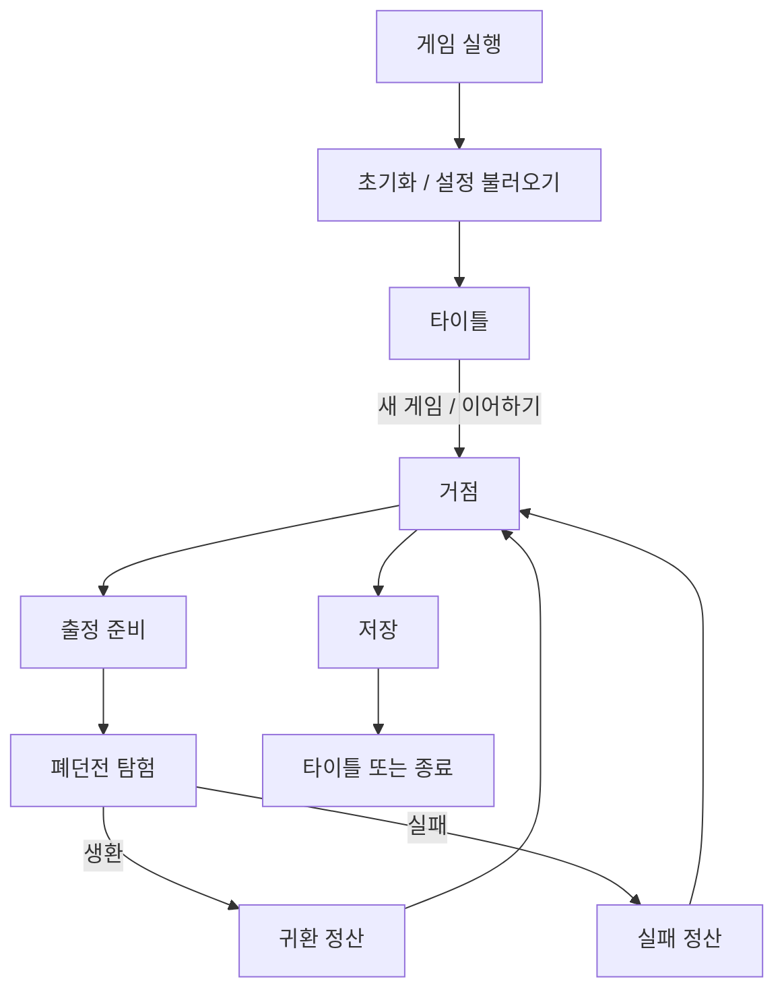

# 폐던전 수색꾼 게임 개발 단계별 제안서

- 문서 버전: v0.1
- 문서 상태: 초기 개발 제안
- 주 사용처: Codex 기반 구현 계획 및 작업 분할
- 기준 문서: `스토리 정리 v1.5.md`
- 대상: PC 싱글플레이 게임을 우선 가정
- 엔진·언어: 미정. 본 문서는 엔진 독립적으로 작성함

---

## 0. 제안 요약

이 프로젝트는 다음 순서로 진행하는 것을 권장한다.

> **핵심 탐험 재미 검증 → 최소 제품 흐름 연결 → 주요 게임 시스템 확장 → 반복 탐험 구조 확립 → 제품 기능 완성 → 콘텐츠·연출·출시 준비**

핵심 원칙은 두 가지다.

1. **게임의 재미는 먼저 검증한다.**  
   폐던전에서 물건을 회수하고, 위험과 적재량을 계산하며, 더 들어갈지 퇴각할지를 고민하는 경험이 성립하는지 우선 확인한다.

2. **제품 골격은 늦게 붙이지 않는다.**  
   핵심 재미가 최소한 확인되면 곧바로 `실행 → 타이틀 → 거점 → 출정 → 탐험 → 정산 → 저장 → 재실행 → 이어하기` 흐름을 연결한다. 다만 이 단계에서는 화면과 연출을 완성하지 않고 기능만 작동하게 만든다.

처음부터 타이틀·옵션·저장 슬롯을 완성하면 핵심 게임 변경 때 재작업이 커지고, 반대로 던전만 오래 만든 뒤 제품 기능을 붙이면 저장·입력·상태 전환 구조가 꼬이기 쉽다. 따라서 **게임 요소가 우선이되, 제품 요소의 최소 기반은 일찍 연결하는 방식**이 가장 안전하다.

---

# 1. 개발 기준이 되는 확정 방향

구현 중 해석이 흔들리지 않도록, 현재 세계관 문서에서 게임 설계에 직접 영향을 주는 사항만 개발 제약으로 정리한다.

## 1-1. 플레이어와 핵심 감정

- 플레이어는 처음부터 폐던전을 뒤지는 **수색꾼**이다.
- 선택받은 영웅이나 세계 구원자가 아니다.
- 초반 목표는 사건 해결이 아니라 생계 유지다.
- 정면 전투보다 관찰, 회피, 도구 활용, 짐 관리, 퇴각 판단이 중요하다.
- 핵심 감정은 승리보다 **욕심, 불안, 계산, 생환의 안도감**이다.
- 성장은 공격력 상승보다 더 많은 변수를 관리하고 더 안전하게 회수하는 방향이 우선이다.

## 1-2. 폐던전의 게임 규칙

- 폐던전은 코어가 파괴되어 범람 위험은 사라졌지만 내부 위험과 회수품이 남은 던전이다.
- 폐던전은 자가 복구하지 않으며, 잔존 에너지 때문에 일부 장치·함정·공간이 불규칙하게 작동한다.
- 반복 탐험은 완전 절차 생성보다 **고정된 큰 지도**를 중심으로 한다.
- 반복마다 구역별 아이템 후보, 위험 이벤트, 일부 문의 개폐, 적 또는 장치 배치가 달라질 수 있다.
- 폐품과 일부 잔재는 반복 등장할 수 있다.
- 고유 유물과 핵심 기록물은 원본이므로 1회성이다.
- 잔여 구역은 기본 공략 루트 바깥의 작은 방, 짧은 우회로, 숨겨진 공간으로 구성할 수 있다.

## 1-3. 거점과 장기 진행

- 거점에서는 판매, 감정, 연구 등록, 수리, 장비 준비, 출정이 이루어진다.
- 장기 목표는 거점과 장비를 개선하고 더 깊은 구역을 안전하게 수색하는 것이다.
- 고유 유물과 핵심 기록물은 실수로 판매되지 않도록 판매 불가로 두는 방향이 우선이다.
- 세계관 설명은 짧은 발견물, 아이템 설명, 연구자 해설, NPC 반응으로 선택적으로 제공한다.
- 마왕과 부활 세력은 핵심 진행이 아니라 선택적 배경 떡밥이다.

## 1-4. 피해야 할 구현 방향

- 전투력을 올려 모든 적을 제거하는 전형적 전투 RPG 구조
- 매번 전체 지형이 완전히 바뀌는 대규모 절차 생성부터 구현하는 것
- 핵심 플레이 검증 전에 NPC·스토리·아이템 콘텐츠를 대량 제작하는 것
- 옵션·타이틀 연출·도전 과제부터 완성하는 것
- 표시 이름, 키 입력, 아이템 수치, UI 문자열을 코드에 직접 고정하는 것
- 저장 시스템을 개발 후반까지 미루는 것

---

# 2. 전체 제품 구조

## 2-1. 플레이어가 경험하는 전체 흐름



## 2-2. 시스템을 다섯 영역으로 구분

| 영역 | 포함 요소 | 개발 성격 |
|---|---|---|
| 게임 셸 | 부팅, 타이틀, 새 게임, 이어하기, 옵션, 로딩, 종료 | 제품 기반 |
| 핵심 탐험 | 이동, 조사, 회수, 위험, 인벤토리, 퇴각, 생환 | 핵심 재미 |
| 메타 게임 | 거점, 상점, 감정, 연구, 장비, 수리, 성장 | 반복 동기 |
| 공통 기반 | 상태 전환, 입력, 저장, 설정, 오디오, UI, 데이터 | 전체 시스템 연결 |
| 제품 완성 | 접근성, 컨트롤러, 오류 처리, 크레딧, 빌드, QA | 출시 품질 |

## 2-3. 권장 모듈 경계

엔진에 맞춰 명칭은 바꿀 수 있지만 역할은 분리한다.

```text
App/
  Bootstrap
  SceneFlow
  GameState

Core/
  IDs
  Events
  Time
  CommonTypes

Gameplay/
  Player
  Interaction
  Exploration
  Hazards
  Inventory
  Loot
  Extraction

Meta/
  Hub
  Economy
  Equipment
  Appraisal
  Research
  Progression

Infrastructure/
  Save
  Settings
  Input
  Audio
  Localization
  Logging

UI/
  Title
  HUD
  Inventory
  Map
  Hub
  Results
  Options
  Dialogs

Data/
  Items
  LootTables
  Rooms
  Hazards
  Economy
  Localization

Tests/
  Unit
  Integration
  Smoke
```

중요한 원칙은 다음과 같다.

- UI가 게임 규칙을 직접 소유하지 않는다.
- 저장 시스템이 특정 화면이나 장면에 종속되지 않는다.
- 아이템 표시 이름과 내부 식별자를 분리한다.
- 입력은 `E 키`, `W 키`가 아니라 `상호작용`, `이동` 같은 행동 단위로 정의한다.
- 콘텐츠와 밸런스 수치는 가능한 한 데이터로 분리한다.
- 화면 전환은 개별 버튼이 직접 장면을 불러오는 방식보다 중앙 흐름 관리자를 거친다.

---

# 3. 수정 가능성을 고려한 개발 운영 원칙

## 3-1. 각 단계는 검토 관문을 가진다

다음 단계로 넘어가기 전에 반드시 현재 결과를 플레이하고 결정 사항을 갱신한다.

| 관문 | 확인할 핵심 질문 | 이 시점에 고정할 것 |
|---|---|---|
| G0 프로젝트 기반 | 어떤 환경에서 개발할 것인가? | 엔진, 버전, 플랫폼, 기본 입력 장치 |
| G1 핵심 재미 | 회수·욕심·퇴각이 재미있는가? | 핵심 탐험 루프와 최소 정보 구조 |
| G2 제품 순환 | 실행부터 재실행까지 한 바퀴 도는가? | 게임 상태, 저장 경계, 장면 흐름 |
| G3 탐험 시스템 | 위험을 능동적으로 다룰 수 있는가? | 위험·도구·인벤토리의 주요 규칙 |
| G4 메타 게임 | 귀환 후 다음 탐험 동기가 생기는가? | 경제·성장·정산의 핵심 구조 |
| G5 반복성 | 같은 던전에 다시 들어갈 이유가 있는가? | 랜덤 범위와 1회성 콘텐츠 규칙 |
| G6 제품 완성 | 일반 사용자가 불편 없이 실행 가능한가? | 옵션, 저장 안정성, 접근성 범위 |
| G7 출시 후보 | 빌드가 반복 검증을 통과하는가? | 기능 동결 및 출시 범위 |

## 3-2. 결정 기록을 별도 관리한다

추천 문서 구조는 다음과 같다.

```text
docs/
  00_PROJECT_CONTEXT.md
  01_PRODUCT_VISION.md
  02_CORE_LOOP.md
  03_SCREEN_FLOW.md
  04_GAME_STATES.md
  05_SAVE_SCHEMA.md
  06_INPUT_ACTIONS.md
  07_DATA_SCHEMA.md
  08_TEST_PLAN.md
  09_BACKLOG.md
  10_OPEN_QUESTIONS.md
  CHANGELOG_DESIGN.md
  decisions/
    ADR-0001-*.md
    ADR-0002-*.md
```

`ADR`은 되돌리기 어려운 결정을 기록하는 문서다. 각 문서는 다음 정도만 포함하면 된다.

```text
제목
상태: 제안 / 확정 / 폐기 / 대체
결정 배경
선택한 방향
대안
영향받는 시스템
다시 검토할 조건
```

## 3-3. 변경을 쉽게 만드는 기술적 규칙

- 기능을 완성하기 전에 인터페이스와 데이터 경계를 먼저 정의한다.
- 실험 중인 기능은 기능 플래그 또는 설정값으로 켜고 끌 수 있게 한다.
- 저장 데이터에는 반드시 스키마 버전을 둔다.
- 저장 데이터에서 표시 이름이 아니라 안정적인 ID를 사용한다.
- 밸런스 수치는 코드가 아니라 데이터 파일이나 편집 가능한 리소스에 둔다.
- 테스트용 던전과 실제 콘텐츠 던전을 분리한다.
- 디버그 메뉴에서 거점, 던전, 정산 화면으로 바로 이동할 수 있게 한다.
- 새 시스템을 추가할 때 기존 시스템을 몰래 대체하지 않고, 대체 여부를 결정 기록에 남긴다.
- 한 작업 티켓에서 관련 없는 대규모 리팩터링을 함께 하지 않는다.

## 3-4. 어느 시점까지 바꾸기 쉬운가

| 항목 | 비교적 자유롭게 바꿀 수 있는 시점 | 늦게 바꾸면 영향이 큰 시점 |
|---|---|---|
| 카메라·조작 방식 | G0~G1 | G2 이후 UI·레벨·입력 전반 영향 |
| 인벤토리 표현 방식 | G1~G2 | G3 이후 아이템·HUD·저장 영향 |
| 사망 손실 규칙 | G1~G3 | G4 이후 경제·저장·난이도 영향 |
| 저장 시점 | G0~G2 | G3 이후 모든 진행 데이터 영향 |
| 아이템 분류 | G1~G3 | G4 이후 상점·감정·연구·콘텐츠 영향 |
| 경제 수치 | G4~G7까지 조정 가능 | 구조보다 수치 조정이므로 상대적으로 유연 |
| UI 시각 디자인 | G5 이후에도 변경 가능 | 기능 구조와 정보 우선순위는 G3 전에 확정 권장 |
| 세부 스토리·텍스트 | G5 이후 | 핵심 진행에 결합하면 수정 비용 증가 |

---

# 4. 단계별 개발 제안

---

## 단계 0. 프로젝트 기반과 결정 문서

### 목표

구현을 시작하기 전에 Codex가 따라야 할 환경, 범위, 폴더 구조, 검증 방법을 명시한다. 이 단계에서는 게임 콘텐츠를 만들지 않는다.

### 작업 항목

1. 엔진, 엔진 버전, 사용 언어, 목표 플랫폼을 `00_PROJECT_CONTEXT.md`에 기록한다.
2. 저장소 기본 구조와 브랜치 규칙을 정한다.
3. 빌드·실행·테스트 명령을 문서화한다.
4. 코드 스타일, 네이밍, 폴더 책임을 정한다.
5. 게임 상태의 최소 목록을 정의한다.
   - Boot
   - Title
   - Hub
   - Loadout
   - Exploration
   - Results
   - Failure
   - Pause
   - Loading
6. 입력 행동의 최소 목록을 정의한다.
   - Move
   - Look 또는 Aim
   - Interact
   - UseTool
   - Inventory
   - Map
   - Pause
   - Drop
7. 데이터와 사용자 표시 문자열을 분리할 기본 방식을 정한다.
8. 로그와 디버그 실행 경로를 마련한다.
9. 최소 자동 테스트 또는 스모크 테스트 구조를 만든다.

### 결과물

- 빈 프로젝트가 경고 없이 실행된다.
- 테스트 명령이 동작한다.
- `docs/` 기본 문서가 생성된다.
- 각 모듈의 책임이 문서로 정리된다.
- 디버그 시작 장면 또는 개발용 진입점이 있다.

### 완료 조건

- 새로운 작업자가 저장소를 받아 문서만 보고 실행할 수 있다.
- Codex가 어떤 파일을 수정해야 하고 어디까지 수정하면 안 되는지 알 수 있다.
- 엔진 버전과 빌드 명령이 단일 문서에 명확하게 적혀 있다.

### 이 단계에서 확정할 결정

- 2D 탑다운, 3D 1인칭, 3D 3인칭 등 기본 표현 방식
- 키보드·마우스 우선인지, 컨트롤러 동시 지원인지
- PC 우선 플랫폼과 기본 해상도 기준
- 데이터 저장 형식의 큰 방향

### 이 단계에서 하지 않을 것

- 완성형 타이틀 화면
- 실제 상점과 경제
- 다수의 아이템과 던전 콘텐츠
- 최종 UI 디자인

---

## 단계 1. 핵심 탐험 프로토타입

### 목표

가장 작은 폐던전에서 **회수, 위험 판단, 적재, 퇴각, 생환**이 재미있는지 검증한다.

### 최소 구현 범위

- 플레이어 이동과 카메라
- 조사·상호작용
- 단순한 테스트 던전 한 곳
- 회수품 몇 종류
- 무게 또는 슬롯 기반 적재 제한
- 예상 가치 표시
- 위험 요소 한두 종류
- 단순 회피 또는 우회 수단
- 출구와 귀환 판정
- 실패 판정
- 임시 인벤토리
- 임시 HUD
- 플레이 결과 로그

### 권장 테스트 던전 구조

```text
입구
 ├─ 안전하지만 값싼 방
 ├─ 짧은 우회로
 ├─ 위험하지만 가치 높은 방
 └─ 출구로 돌아오는 경로
```

플레이어가 적어도 한 번은 다음 선택을 하게 해야 한다.

- 가벼운 물건 여러 개와 무거운 고가품 중 무엇을 챙길지
- 위험 구역에 들어갈지
- 도구를 지금 쓸지 아낄지
- 더 탐색할지 돌아갈지
- 짐 일부를 버리고 탈출할지

### 완료 조건

- 별도 타이틀 없이 테스트 장면에서 1회의 탐험을 시작하고 끝낼 수 있다.
- 플레이어가 아이템을 회수한 뒤 적재 한도 때문에 선택을 해야 한다.
- 위험을 피하거나 완화할 방법이 최소 하나 있다.
- 출구에 도달하면 회수 결과가 표시된다.
- 실패 원인이 로그나 화면에 표시된다.
- 최소한 한 번의 내부 플레이테스트에서 “더 들어갈지 돌아갈지” 판단이 발생한다.

### 검토 질문

- 회수 행동이 단순 클릭 반복으로 느껴지지 않는가?
- 무게와 가치가 실제 선택을 만드는가?
- 위험을 알아차릴 단서가 충분한가?
- 약한 플레이어가 수동적으로 도망만 다니지 않고 능동적으로 대응할 수 있는가?
- 생환했을 때 안도감이 있는가?

### 변경 가능성이 큰 항목

- 적재 방식: 무게, 칸, 형태, 혼합
- 위험 표현: 시야, 소음, 시간, 구조 붕괴
- 인벤토리 중 일시정지 여부
- 실패 시 손실 규칙
- 전투를 완전히 배제할지, 최소한의 방어 행동을 둘지

### 이 단계에서 하지 않을 것

- 완성형 저장 시스템
- 여러 NPC와 상점
- 완전한 랜덤 생성
- 최종 아트와 사운드
- 긴 튜토리얼

---

## 단계 2. 최소 제품 순환 수직 조각

### 목표

게임이 하나의 실행 가능한 제품처럼 처음부터 끝까지 순환하도록 만든다.

### 반드시 연결할 흐름

```text
게임 실행
→ 임시 타이틀
→ 새 게임
→ 임시 거점
→ 출정 준비
→ 테스트 폐던전
→ 귀환 또는 실패
→ 임시 정산
→ 거점
→ 저장
→ 게임 종료
→ 재실행
→ 이어하기
```

### 최소 구현 범위

#### 게임 셸

- Boot 초기화
- 임시 타이틀
- 새 게임
- 이어하기
- 최소 옵션
- 종료
- 로딩 또는 전환 표시

#### 거점과 정산

- 출정 버튼
- 현재 돈·장비·보관품의 임시 표시
- 회수품 판매의 단순 버전
- 탐험 결과 화면
- 다음 출정을 위한 최소 준비

#### 저장

- 설정 데이터와 진행 데이터 분리
- 최소 1개 저장 슬롯
- 자동 저장 시점 정의
- 저장 스키마 버전
- 이어하기
- 잘못된 저장 데이터에 대한 최소 오류 처리

#### 상태 관리

- Title, Hub, Exploration, Results 상태 전환
- 일시정지와 타이틀 복귀
- 중복 로딩 방지
- 전환 중 입력 차단

### 권장 최소 옵션

- 전체 음량
- 화면 모드
- 해상도 또는 렌더링 크기
- 기본 입력 안내

상세 그래픽, 키 변경, 접근성 옵션은 아직 완성하지 않는다.

### 완료 조건

- 실행 후 메뉴 조작만으로 탐험까지 진입할 수 있다.
- 탐험 결과가 거점 데이터에 반영된다.
- 게임을 종료하고 재실행해도 돈, 장비, 진행 상태가 유지된다.
- 저장 데이터가 없을 때 이어하기가 비활성화된다.
- 타이틀 복귀 시 손실 범위를 명확히 안내한다.
- 전체 흐름을 자동 또는 수동 스모크 테스트로 반복할 수 있다.

### 검토 질문

- 저장해야 할 데이터와 세션 중에만 필요한 데이터가 구분되는가?
- 탐험 종료와 실패 처리의 경계가 명확한가?
- 거점이 단순 메뉴여도 다음 탐험 동기를 제공하는가?
- 이어하기가 어느 상태에서 시작되는지 일관적인가?

### 이 단계에서 고정할 항목

- 전체 게임 상태와 주요 전환
- 진행 저장과 설정 저장의 분리
- 자동 저장의 기본 시점
- 탐험 결과가 거점에 반영되는 데이터 경로
- 아이템과 장비의 안정적인 ID 규칙

### 이 단계에서 하지 않을 것

- 타이틀 일러스트와 메뉴 애니메이션
- 여러 저장 슬롯의 완성형 UI
- 클라우드 저장
- 도전 과제
- 완성된 거점 맵

---

## 단계 3. 핵심 탐험 시스템 확장

### 목표

폐던전 수색꾼이라는 정체성이 실제 플레이 규칙으로 느껴지게 한다.

### 3-1. 위험 인지와 대응

- 위험의 사전 징후
- 시야 또는 소음 규칙
- 고장 난 골렘·장치·함정
- 문 잠금, 붕괴 가능 통로, 불안정한 공간
- 유인, 차단, 잠깐 무력화, 우회 같은 비전투 대응
- 도구 사용 비용과 제한
- 퇴로 확보와 비상 탈출

### 3-2. 인벤토리와 회수 판단

- 아이템 무게
- 예상 가치
- 미확인 상태
- 폐품, 잔재, 고유 유물, 핵심 기록물 분류
- 분류 아이콘과 문자 표기
- 정렬과 필터
- 버리기, 교체, 사용
- 판매 불가·의뢰품 보호
- 과적 상태의 명확한 영향

### 3-3. 지도와 잔여 구역

- 공식 공략 루트
- 플레이어가 확인한 방
- 현재 막힌 길
- 출구
- 개인 표식
- 지도와 실제 구조의 어긋남
- 잔여 구역 후보를 암시하는 단서

### 3-4. HUD와 정보 우선순위

항상 보여줄 정보와 상황에 따라 보여줄 정보를 구분한다.

- 생존 상태
- 적재량
- 사용 도구
- 위험 노출 또는 소음
- 상호작용 안내
- 퇴로 정보
- 목표 또는 의뢰

### 완료 조건

- 플레이어가 위험을 만나기 전에 알아차릴 수 있는 단서가 있다.
- 적 또는 위험을 제거하지 않고 지나갈 방법이 둘 이상 있다.
- 인벤토리에서 가치·무게·분류를 비교할 수 있다.
- 짐을 버리는 행동이 실제 탈출에 도움이 된다.
- 잔여 구역 하나가 기본 루트 바깥의 선택적 목표로 작동한다.
- 지도는 정답지가 아니라 탐색 보조 도구로 기능한다.

### 검토 질문

- 위험이 무작위 처벌이 아니라 판단 가능한 위협인가?
- UI가 정보를 숨겨 난이도를 만드는 것은 아닌가?
- 도구가 단순 열쇠가 아니라 여러 상황에 응용 가능한가?
- 색상에만 의존하지 않고 분류가 구분되는가?
- 인벤토리 관리가 탐험보다 오래 걸리지 않는가?

### 이 단계에서 고정할 항목

- 핵심 위험 자원
- 도구 슬롯과 사용 방식
- 인벤토리의 핵심 모델
- 맵 정보의 공개 범위
- 일시정지와 메뉴 동작

---

## 단계 4. 거점·경제·성장 시스템

### 목표

탐험 결과가 다음 탐험 준비로 이어지고, 반복 플레이의 장기 동기가 생기게 한다.

### 4-1. 귀환 정산

- 회수품 목록
- 총 예상 가치와 실제 판매 가치
- 장비 손상
- 수리 비용
- 탐험 비용
- 순이익
- 새 발견물
- 완료한 의뢰
- 발견한 잔여 구역

### 4-2. 거점 기능

- 보관함
- 장비 장착과 해제
- 상점
- 수리
- 감정
- 연구자 등록
- 출정 준비
- 최소한의 길드 또는 의뢰 기능

### 4-3. 아이템 처리 규칙

| 분류 | 기본 처리 |
|---|---|
| 폐품 | 판매, 수리·제작 재료 |
| 잔재 | 감정 후 판매 또는 연구·수집에 사용 |
| 고유 유물 | 판매 불가, 등록·정보·보상 |
| 핵심 기록물 | 판매 불가, 연구자 보관 목록 등록 |
| 미확인 물품 | 감정 전 정확한 분류와 가치 비공개 |

### 4-4. 성장 방향

우선순위가 높은 성장 예시는 다음과 같다.

- 적재 능력 개선
- 도구 슬롯 또는 사용 효율 개선
- 위험 정보 정확도 향상
- 감정 전 가치 추정 개선
- 장비 내구도와 수리 효율 개선
- 퇴각 손실 완화
- 새로운 잔여 구역 접근 수단
- 거점 서비스 해금

공격력·체력 같은 전투 수치는 핵심 성장을 대체하지 않도록 한다.

### 완료 조건

- 탐험에서 가져온 물건을 판매·감정·등록할 수 있다.
- 비용을 제외한 순이익이 정산에서 명확히 보인다.
- 플레이어가 얻은 이익으로 다음 탐험 준비를 개선할 수 있다.
- 최소 두 가지 성장 선택이 서로 다른 플레이 방식을 만든다.
- 고유 유물과 핵심 기록물이 실수로 판매되지 않는다.
- 거점에서 한 행동이 저장되고 다음 탐험에 반영된다.

### 검토 질문

- 정산 화면이 보상 감정을 충분히 전달하는가?
- 경제가 의미 있는 압박을 주지만 재기를 막지는 않는가?
- 성장 후 플레이어가 강해졌다기보다 노련해졌다고 느끼는가?
- 감정 시스템이 단순 수수료 창구로만 느껴지지 않는가?
- 거점 메뉴 이동이 반복 피로를 만들지 않는가?

### 이 단계에서 고정할 항목

- 돈과 비용의 흐름
- 판매·감정·연구의 역할 분담
- 장비와 거점 성장의 큰 축
- 사망·실패 후 유지되는 진행도

---

## 단계 5. 반복 탐험과 콘텐츠 데이터 구조

### 목표

같은 폐던전을 반복해도 완전히 동일하지 않으며, 이미 끝난 장소에서 새로운 가능성을 발견하는 감각을 만든다.

### 5-1. 기본 반복 구조

- 큰 지도는 고정한다.
- 구역마다 아이템 후보 풀을 둔다.
- 위험 이벤트 후보 풀을 둔다.
- 일부 방과 문의 출입 상태가 달라질 수 있다.
- 적 또는 장치 위치는 제한된 범위 안에서 변한다.
- 다른 수색꾼은 직접 만남보다 흔적으로 표현한다.
- 1회성 수집품은 재등장하지 않는다.

### 5-2. 잔존 에너지 규칙의 게임화

- 새로운 보물을 생성하는 것이 아니라 숨어 있던 물건이 노출된다는 설정을 유지한다.
- 한 탐험에서 등장하는 기본 보상량은 일정 범위 안에 둔다.
- 시간이 지날수록 보상이 단순 감소하는 구조는 피한다.
- 고유 유물이나 핵심 기록물을 회수한 방은 다음 방문부터 소실, 봉쇄, 상호작용 감소 등의 변화를 가질 수 있다.

### 5-3. 데이터화할 항목

- ItemDefinition
- ItemCategory
- LootTable
- RoomDefinition
- RoomState
- HazardDefinition
- EncounterDefinition
- ResidualZoneRule
- UniquePickupState
- ResearchEntry
- EconomyRule
- ProgressionUnlock

각 데이터에는 표시 이름과 별개의 안정적 ID를 사용한다.

### 5-4. 재현 가능한 랜덤

테스트와 오류 재현을 위해 탐험 단위 시드 또는 동등한 재현 장치를 권장한다.

- 특정 시드로 같은 아이템·위험 배치를 재현할 수 있다.
- 저장에는 필요한 경우 현재 탐험 시드와 이미 소비한 이벤트 상태를 기록한다.
- 오류 제보 로그에 시드와 던전 버전을 남긴다.

### 완료 조건

- 같은 던전을 연속으로 탐험했을 때 아이템과 위험의 일부가 달라진다.
- 구역의 정체성과 획득 후보가 유지된다.
- 고유 유물은 한 번 획득하면 다시 나오지 않는다.
- 특정 테스트 시드를 통해 동일한 상황을 재현할 수 있다.
- 콘텐츠 추가가 기존 시스템 코드 수정 없이 데이터 추가 중심으로 가능하다.

### 검토 질문

- 랜덤 변화가 구역의 의미를 지워버리지 않는가?
- 플레이어가 배운 지식이 다음 탐험에도 유효한가?
- 보상량의 편차가 지나치게 크지 않은가?
- 1회성 수집품이 누락되거나 중복 생성될 가능성이 없는가?
- 반복 탐험이 단순 파밍이 아니라 새로운 판단을 만드는가?

### 이 단계에서 고정할 항목

- 랜덤화 범위
- 구역별 콘텐츠 풀의 구조
- 1회성 상태 저장 방식
- 탐험 시드와 재현 방식

---

## 단계 6. 제품 기능과 사용성 완성

### 목표

개발자용 프로토타입을 일반 사용자가 실행 가능한 게임 제품으로 정리한다.

### 6-1. 타이틀과 저장 관리

- 이어하기
- 새 게임
- 불러오기
- 저장 슬롯
- 덮어쓰기 확인
- 삭제 확인
- 저장 중 표시
- 저장 실패 안내
- 백업 또는 복구 정책
- 버전 표시

### 6-2. 옵션

#### 화면

- 해상도
- 전체 화면, 테두리 없는 창, 창 모드
- 수직 동기화
- 프레임 제한
- 밝기 또는 감마
- UI 크기
- 3D일 경우 품질 설정

#### 오디오

- 전체 음량
- 음악
- 효과음
- UI 효과음
- 음성이 있다면 음성 음량
- 창 비활성화 시 음소거

#### 조작

- 키 변경
- 마우스 감도
- 컨트롤러 진동
- 데드존
- 길게 누르기와 토글
- 입력 초기화
- 버튼 아이콘 자동 전환

#### 게임 플레이와 접근성

- 자막
- 자막 크기
- 텍스트 속도
- 화면 흔들림 감소
- 번쩍임 감소
- 색상 외 분류 표기
- 상호작용 홀드 완화
- 튜토리얼 다시 보기
- 난이도 또는 보조 설정이 있다면 해당 항목

### 6-3. 오류와 예외 처리

- 저장 데이터 없음
- 저장 데이터 손상
- 저장 공간 부족
- 컨트롤러 연결 해제
- 키 중복 설정
- 해상도 변경 실패와 자동 복귀
- 로딩 실패
- 탐험 중 타이틀 복귀 경고
- 오래된 저장 데이터 변환
- 창 비활성화 처리

### 6-4. 로딩과 일시정지

- 장면 전환 중 중복 입력 방지
- 진행 표시 또는 정지 화면
- 일시정지 상태의 일관성
- 인벤토리·지도·옵션 중 시간 처리
- 저장이 끝나기 전 종료 방지

### 완료 조건

- 키보드·마우스로 전체 플레이가 가능하다.
- 목표 범위에 컨트롤러가 포함되면 컨트롤러만으로도 전체 플레이가 가능하다.
- 옵션이 게임 재시작 후 유지된다.
- 잘못된 화면 설정은 자동 복구된다.
- 색상만 보지 않고 아이템 분류가 가능하다.
- 저장 실패와 손상 상황이 사용자에게 명확히 안내된다.
- 타이틀부터 종료까지 마우스·키보드·컨트롤러 포커스가 끊기지 않는다.

### 검토 질문

- 첫 실행 사용자가 별도 설명 없이 새 게임을 시작할 수 있는가?
- 어두운 던전이 모니터 환경 차이 때문에 불공정해지지 않는가?
- 메뉴와 텍스트 크기가 목표 해상도에서 읽히는가?
- 실수로 진행을 잃을 수 있는 행동에는 확인 절차가 있는가?

---

## 단계 7. 콘텐츠·튜토리얼·연출·밸런스

### 목표

안정된 시스템 위에 실제 게임 분량과 분위기를 채운다.

### 작업 항목

- 첫 실행 설정과 밝기 조정
- 튜토리얼 수색꾼 또는 도움말
- 첫 폐던전의 정식 레벨 구성
- 거점 NPC와 최소 대화
- 상인, 감정사, 연구자, 길드 관리자 기능 연결
- 폐품·잔재·고유 유물·기록물 콘텐츠
- 잔여 구역과 발견물
- 탐험 및 거점 음악
- 위험 징후와 상호작용 효과음
- 정산 연출
- 아이템·도감·연구 텍스트
- 난이도와 경제 밸런스
- 반복 피로 완화
- 성능 최적화

### 콘텐츠 제작 원칙

- 시스템을 시험하는 데 필요한 최소 콘텐츠부터 만든다.
- 동일 기능의 아이템을 이름만 바꿔 대량 생산하지 않는다.
- 각 구역은 고유한 회수품과 위험 후보를 가진다.
- 세계관 설명은 플레이 흐름을 막지 않도록 선택적으로 제공한다.
- 마왕 관련 떡밥은 필수 진행이 아니라 발견물 수준으로 유지한다.
- 던전은 어둡고 긴장감 있게, 거점은 생활감과 약간의 유머가 있게 구성한다.

### 완료 조건

- 처음 시작한 플레이어가 튜토리얼을 통해 첫 탐험과 귀환을 완료할 수 있다.
- 첫 던전 안에서 기본 루트, 위험 선택, 잔여 구역, 생환 판단을 모두 경험한다.
- 플레이어가 여러 번 탐험한 뒤에도 새 발견 또는 성장 목표를 확인할 수 있다.
- 주요 경제 수치가 극단적 파산이나 무의미한 부를 만들지 않는다.
- 텍스트와 연출이 핵심 플레이를 과도하게 중단하지 않는다.

---

## 단계 8. 출시 준비와 회귀 검증

### 목표

기능 추가를 멈추고 안정성, 호환성, 성능, 법적·플랫폼 요구를 점검한다.

### 작업 항목

- 기능 동결
- 전체 회귀 테스트
- 저장 데이터 마이그레이션 테스트
- 새 게임부터 장기 진행까지 테스트
- 각 지원 해상도와 화면 모드 테스트
- 키보드·마우스·컨트롤러 테스트
- 프레임 드롭과 메모리 확인
- 예외 종료와 저장 손상 테스트
- 버전·빌드 번호
- 크레딧
- 외부 에셋·라이브러리 라이선스
- 오류 로그 위치와 제보 방법
- 배포 빌드 생성 절차
- 플랫폼별 요구 기능
- 클라우드 저장과 도전 과제는 실제 출시 범위에 포함된 경우에만 적용

### 완료 조건

- 동일한 소스에서 재현 가능한 배포 빌드를 만들 수 있다.
- 핵심 스모크 테스트와 회귀 테스트가 통과한다.
- 이전 지원 버전의 저장 파일을 불러오거나 명확히 거부한다.
- 치명적 오류 없이 `실행 → 플레이 → 저장 → 종료 → 이어하기`가 반복된다.
- 크레딧과 라이선스가 누락되지 않는다.
- 알려진 문제와 출시 제외 기능이 문서화된다.

---

# 5. Codex 작업 방식 제안

## 5-1. 한 번에 하나의 작업 티켓만 수행

Codex에는 큰 단계 전체를 한 번에 요청하지 않는다. 한 작업은 다음 조건을 만족해야 한다.

- 명확한 단일 목표가 있다.
- 수정 허용 범위가 정해져 있다.
- 수정하지 않을 범위가 적혀 있다.
- 수용 기준이 테스트 가능하다.
- 실행 또는 검증 명령이 있다.
- 관련 문서 갱신 여부가 적혀 있다.

## 5-2. 권장 작업 프롬프트 형식

```text
[작업 ID]

목표:
- 이번 작업에서 달성할 단일 결과

배경:
- 왜 필요한지
- 현재 시스템과 어떤 관계인지

참조 문서:
- docs/...
- 관련 ADR

수정 허용 범위:
- 수정 가능한 폴더 또는 파일

수정 금지 범위:
- 이번 작업과 무관한 시스템
- 대규모 리팩터링 금지 여부

구현 요구사항:
1.
2.
3.

수용 기준:
- 사용자가 확인 가능한 결과
- 자동 테스트 또는 재현 절차

검증 명령:
- 빌드
- 테스트
- 실행

문서 갱신:
- 변경된 설계나 열린 질문을 어디에 기록할지

주의:
- 요청 범위를 넘어 새 기능을 추가하지 말 것
- 기존 저장 호환성에 영향이 있으면 구현 전에 명시할 것
- 모호한 부분은 가장 되돌리기 쉬운 방식으로 구현하고 OPEN_QUESTIONS에 기록할 것
```

## 5-3. Codex가 작업을 시작하기 전 확인할 내용

각 작업에서 Codex가 먼저 다음을 확인하게 한다.

1. 현재 저장소 구조와 관련 파일
2. 기존에 같은 기능이 있는지
3. 영향받는 테스트와 저장 데이터
4. 요청과 충돌하는 기존 결정 문서
5. 변경할 파일 목록

그 후 구현, 테스트, 문서 갱신 순서로 진행한다.

## 5-4. 작업 완료 보고 형식

```text
변경 요약
수정한 파일
추가·수정한 테스트
실행한 검증 명령과 결과
저장 데이터 영향
남은 제한 사항
새로 생긴 열린 질문
```

## 5-5. Git 운영 권장

- `main`은 실행 가능한 상태를 유지한다.
- 단계 또는 작은 기능 단위로 브랜치를 나눈다.
- 관련 없는 변경을 한 커밋에 섞지 않는다.
- 결정 변경과 코드 변경을 같은 작업에서 함께 기록한다.
- 수용 기준을 통과한 뒤 병합한다.
- 자동 생성 파일, 캐시, 빌드 결과는 저장소 규칙에 맞게 제외한다.

---

# 6. 권장 최초 작업 티켓 순서

아래 목록은 실제 저장소가 생성된 뒤 Codex에 순서대로 맡길 수 있는 초기 백로그다. 엔진에 따라 세부 파일명은 조정한다.

## 기반 단계

### DEV-0001 프로젝트 컨텍스트 문서 생성

- 엔진, 버전, 플랫폼, 언어, 실행·테스트 명령을 문서화한다.
- 완료 조건: 처음 보는 사람이 문서만으로 프로젝트를 실행할 수 있다.

### DEV-0002 폴더·모듈 경계 생성

- App, Core, Gameplay, Meta, Infrastructure, UI, Data, Tests 구조를 만든다.
- 완료 조건: 각 폴더의 책임이 README 또는 아키텍처 문서에 적혀 있다.

### DEV-0003 기본 게임 상태 관리자

- Boot, Title, Hub, Exploration, Results 상태와 안전한 전환 인터페이스를 만든다.
- 완료 조건: 개발용 버튼으로 상태를 순환하고 중복 전환을 막는다.

### DEV-0004 입력 행동 추상화

- 이동, 상호작용, 인벤토리, 지도, 일시정지 행동을 정의한다.
- 완료 조건: 실제 키가 코드 곳곳에 직접 사용되지 않는다.

### DEV-0005 데이터 ID와 기본 정의

- 아이템 등 콘텐츠가 사용할 안정적 ID와 기본 데이터 정의를 만든다.
- 완료 조건: 표시 이름 변경이 저장 데이터 ID에 영향을 주지 않는다.

### DEV-0006 테스트·로그·디버그 진입점

- 스모크 테스트, 로그, 개발용 장면 진입 기능을 만든다.
- 완료 조건: 한 명령 또는 명확한 절차로 기본 상태 전환을 검증한다.

## 핵심 탐험 단계

### DEV-0101 플레이어 이동과 카메라

- 테스트 공간에서 이동 가능하게 한다.
- 완료 조건: 목표 입력 장치에서 안정적으로 이동하고 일시정지 시 멈춘다.

### DEV-0102 상호작용 시스템

- 조사 대상 감지, 상호작용 안내, 상호작용 실행을 분리한다.
- 완료 조건: 하나의 회수품과 하나의 문에 같은 인터페이스를 적용한다.

### DEV-0103 최소 아이템·인벤토리

- 아이템 획득, 무게 합계, 버리기를 구현한다.
- 완료 조건: 한도 초과 처리와 UI 표시가 일치한다.

### DEV-0104 가치와 회수 결과

- 아이템의 예상 가치와 탐험 결과 합계를 구현한다.
- 완료 조건: 회수한 아이템만 결과에 포함된다.

### DEV-0105 최소 위험 요소

- 사전 징후가 있는 위험 하나와 회피 수단 하나를 만든다.
- 완료 조건: 플레이어가 운이 아니라 단서를 보고 대응할 수 있다.

### DEV-0106 출구·귀환·실패

- 출구 도달, 생환, 실패 상태를 구현한다.
- 완료 조건: 탐험이 반드시 성공 또는 실패로 종료된다.

### DEV-0107 첫 핵심 루프 플레이테스트 장면

- 안전 경로와 위험 보상 경로가 있는 작은 던전을 만든다.
- 완료 조건: 적재와 위험 때문에 최소 한 번의 선택이 발생한다.

## 최소 제품 순환 단계

### DEV-0201 Boot와 임시 타이틀

- 새 게임, 이어하기, 옵션, 종료의 임시 UI를 만든다.
- 완료 조건: 저장 유무에 따라 이어하기 상태가 달라진다.

### DEV-0202 임시 거점과 출정

- 거점에서 테스트 던전으로 출정할 수 있게 한다.
- 완료 조건: 거점 데이터가 탐험 시작 데이터로 전달된다.

### DEV-0203 귀환 정산과 거점 반영

- 회수품을 돈으로 전환하는 임시 정산을 만든다.
- 완료 조건: 정산 결과가 거점 데이터에 반영된다.

### DEV-0204 설정 저장

- 최소 화면·음량 설정을 저장한다.
- 완료 조건: 재실행 후 설정이 유지된다.

### DEV-0205 진행 저장과 이어하기

- 돈, 인벤토리, 장비, 진행 상태를 저장한다.
- 완료 조건: 종료 후 이어하기로 같은 거점 상태가 복구된다.

### DEV-0206 전체 스모크 테스트

- 실행부터 재실행·이어하기까지 검증한다.
- 완료 조건: 정해진 체크리스트가 반복 통과한다.

이후 작업은 단계 3부터 기능별로 다시 작은 티켓으로 분할한다.

---

# 7. 테스트 전략

## 7-1. 자동 테스트 우선 대상

- 인벤토리 무게 계산
- 가치와 정산 계산
- 판매 가능 여부
- 고유 유물·기록물 중복 방지
- 아이템 ID 직렬화
- 저장·불러오기
- 저장 스키마 마이그레이션
- 옵션 적용과 복구
- 상태 전환
- 랜덤 시드 재현
- 경제 비용과 잔액 처리

## 7-2. 통합 테스트 우선 대상

- 새 게임 → 거점 → 탐험 → 정산 → 저장
- 실패 → 손실 처리 → 거점 복귀
- 타이틀 복귀와 이어하기
- 설정 변경 → 재실행 → 유지
- 고유 유물 획득 → 재탐험 → 미등장
- 컨트롤러 연결 해제와 재연결
- 해상도 변경 실패와 복구

## 7-3. 수동 플레이테스트 질문

- 더 들어갈지 돌아갈지 고민했는가?
- 무엇을 버릴지 고민했는가?
- 위험을 미리 알아차릴 수 있었는가?
- 싸우지 않고 문제를 해결했다는 만족이 있었는가?
- 귀환 후 다음 탐험 준비가 기대되는가?
- 같은 던전에 다시 들어갈 이유가 있는가?
- 실패 원인을 이해할 수 있었는가?
- 메뉴와 정보가 판단을 돕는가, 방해하는가?

## 7-4. 단계 공통 완료 정의

모든 작업 티켓은 다음을 만족해야 완료로 본다.

- 프로젝트가 빌드 또는 컴파일된다.
- 기존 테스트가 깨지지 않는다.
- 새 규칙에는 필요한 테스트가 추가된다.
- 새 경고나 치명적 로그가 없다.
- 사용자 표시 문자열을 코드에 무분별하게 직접 넣지 않는다.
- 저장 데이터 영향이 검토되었다.
- 관련 문서와 열린 질문이 갱신되었다.
- 요청 범위 밖 기능이 임의로 추가되지 않았다.
- 수용 기준을 재현할 방법이 적혀 있다.

---

# 8. 주요 위험과 대응

| 위험 | 발생 결과 | 대응 |
|---|---|---|
| 핵심 재미 전에 제품 UI를 완성 | 게임 변경 때 메뉴·데이터 재작업 | 임시 UI만 사용하고 G1 후 제품 순환 연결 |
| 던전만 장기간 개발 | 저장·상태·입력 구조가 뒤늦게 꼬임 | G1 직후 G2 수직 조각 구축 |
| 전투 기능 확장 | 수색·회피 정체성이 약해짐 | 위험 대응 도구를 먼저 만들고 전투는 제한적으로 검증 |
| 완전 절차 생성부터 개발 | 레벨·밸런스·디버깅 비용 증가 | 고정 지도 + 제한적 변화부터 구현 |
| 콘텐츠를 코드에 하드코딩 | 수정과 추가 비용 증가 | 데이터 정의와 안정적 ID 사용 |
| 저장을 나중에 붙임 | 진행 데이터 전체 재설계 | G2에서 최소 저장·스키마 버전 도입 |
| 색상 중심 UI | 접근성 문제와 정보 오인 | 아이콘·문자·형태를 함께 사용 |
| 경제 압박 과다 | 실패 후 재기 불가 | 최소 안전망과 반복 테스트 마련 |
| 랜덤 편차 과다 | 실력보다 운이 크게 작용 | 구역별 풀과 보상량 범위 제한, 시드 재현 |
| Codex 작업 범위 확장 | 예기치 않은 리팩터링과 회귀 | 티켓별 수정 범위·금지 범위·수용 기준 명시 |
| 결정이 구두로만 변경 | 문서와 코드 불일치 | ADR, CHANGELOG_DESIGN, OPEN_QUESTIONS 갱신 |

---

# 9. 후순위로 미룰 기능

다음 기능은 핵심 루프와 제품 순환이 안정되기 전에는 구현하지 않는 것을 권장한다.

- 화려한 타이틀 연출
- 긴 오프닝 컷신
- 대규모 메인 스토리
- 마왕 부활 세력의 본격 퀘스트
- 여러 폐던전의 대량 제작
- 완전 절차 생성 던전
- 복잡한 제작 시스템
- 암시장과 다중 거래 루트
- 온라인 랭킹
- 멀티플레이
- 사진 모드
- 모드 지원
- 클라우드 저장
- 도전 과제
- 플랫폼별 부가 기능
- 고급 통계와 리플레이
- 음성 연기 전체 적용

이 항목들은 삭제 대상이 아니라 **핵심 구조가 검증된 후 별도 범위로 평가할 후보**다.

---

# 10. 첫 번째 개발 목표

가장 먼저 완성해야 하는 것은 화려한 시작 화면이 아니라 다음 작은 경험이다.

> **작은 폐던전에 들어가 물건을 회수하고, 위험과 적재량 때문에 욕심을 조절하며, 살아서 출구로 돌아온다.**

그다음 완성해야 하는 제품 단위 목표는 다음이다.

> **게임을 실행해 새 게임을 시작하고, 거점에서 출정하여 폐던전을 탐험하고, 귀환 후 정산·저장한 뒤 게임을 재실행해 이어서 플레이할 수 있다.**

이 두 목표를 순서대로 달성하면 이후 시스템과 콘텐츠는 이미 작동하는 순환 위에 추가할 수 있다.

---

# 11. 제안 결론

이 프로젝트의 가장 안전한 개발 순서는 다음과 같다.

1. **프로젝트 기반과 결정 기록 구조를 만든다.**
2. **폐던전 수색의 핵심 재미를 작은 프로토타입으로 검증한다.**
3. **타이틀·거점·출정·탐험·정산·저장·이어하기를 임시 UI로 연결한다.**
4. **위험 대응, 인벤토리, 지도, 잔여 구역 등 탐험 시스템을 확장한다.**
5. **판매, 감정, 연구, 수리, 성장 등 거점과 경제를 연결한다.**
6. **고정 지도 위의 제한적 랜덤 변화와 1회성 수집 규칙을 데이터화한다.**
7. **옵션, 접근성, 컨트롤러, 저장 복구, 오류 처리 등 제품 기능을 완성한다.**
8. **콘텐츠와 연출을 채우고 기능을 동결한 뒤 출시 검증을 진행한다.**

중간 수정 가능성을 낮추는 핵심은 모든 결정을 미리 확정하는 것이 아니다. 오히려 **되돌리기 어려운 결정만 단계별 관문에서 확정하고, 나머지는 데이터와 모듈 경계 안에서 교체 가능하게 두는 것**이다.

Codex에는 이 문서의 단계를 그대로 한 번에 구현하게 하지 않고, `DEV-0001`처럼 작고 검증 가능한 티켓 단위로 요청한다. 각 티켓은 수용 기준과 수정 금지 범위를 포함해야 하며, 완료 후 설계 문서와 열린 질문을 함께 갱신한다.

---

# 부록 A. 단계 진행 체크리스트

## G0 이전

- [ ] 엔진과 버전 확정
- [ ] 목표 플랫폼 확정
- [ ] 카메라·조작 방식 확정
- [ ] 저장소 실행·테스트 문서 작성
- [ ] 모듈 경계 작성

## G1 이전

- [ ] 이동
- [ ] 상호작용
- [ ] 아이템 회수
- [ ] 적재 제한
- [ ] 위험과 대응
- [ ] 출구와 생환
- [ ] 실패
- [ ] 핵심 루프 플레이테스트

## G2 이전

- [ ] Boot
- [ ] 임시 타이틀
- [ ] 새 게임
- [ ] 임시 거점
- [ ] 출정
- [ ] 정산
- [ ] 최소 저장
- [ ] 종료와 이어하기
- [ ] 전체 스모크 테스트

## G3 이전

- [ ] 위험 사전 징후
- [ ] 비전투 대응 두 종류 이상
- [ ] 인벤토리 정식 구조
- [ ] 지도
- [ ] 잔여 구역
- [ ] 도구
- [ ] 일시정지 규칙

## G4 이전

- [ ] 판매
- [ ] 감정
- [ ] 연구 등록
- [ ] 수리
- [ ] 장비 준비
- [ ] 성장 선택
- [ ] 순이익 정산
- [ ] 실패 후 재기 구조

## G5 이전

- [ ] 구역별 아이템 풀
- [ ] 위험 이벤트 풀
- [ ] 출입 상태 변화
- [ ] 1회성 수집품 저장
- [ ] 탐험 시드 재현
- [ ] 데이터 중심 콘텐츠 추가

## G6 이전

- [ ] 저장 슬롯
- [ ] 옵션 전체 범위
- [ ] 입력 재설정
- [ ] 컨트롤러 범위
- [ ] 접근성
- [ ] 오류·예외 처리
- [ ] 저장 복구

## G7 이전

- [ ] 튜토리얼
- [ ] 정식 첫 던전
- [ ] 실제 콘텐츠
- [ ] 오디오·연출
- [ ] 경제·난이도 밸런스
- [ ] 최적화
- [ ] 회귀 테스트
- [ ] 라이선스·크레딧
- [ ] 배포 빌드 절차

---

# 부록 B. 수정 요청 기록 양식

```text
변경 ID:
요청 날짜:
요청자:

변경 내용:

변경 이유:

영향받는 단계:
- G0 / G1 / G2 / G3 / G4 / G5 / G6 / G7

영향받는 시스템:
- 게임 상태
- 저장
- 입력
- 탐험
- 인벤토리
- 경제
- UI
- 콘텐츠
- 기타

기존 저장 호환성 영향:

대안:

선택한 방향:

되돌리기 방법:

관련 ADR 또는 문서:
```

---

# 부록 C. 열린 질문 초기 목록

다음 항목은 구현 전에 모두 확정할 필요는 없지만, 해당 관문 전에는 결정해야 한다.

1. 게임의 카메라와 조작 방식은 무엇인가?
2. 인벤토리는 무게, 칸, 형태, 혼합 중 어떤 방식인가?
3. 인벤토리와 지도를 열면 시간이 멈추는가?
4. 플레이어는 최소한의 직접 공격 수단을 가지는가?
5. 탐험 실패 시 회수품, 장비, 돈, 부상은 각각 어떻게 처리되는가?
6. 던전 중단 저장을 제공하는가? 제공한다면 1회성인가?
7. 거점은 실제 이동 공간인가, 메뉴 중심 화면인가?
8. 기본 플레이 시간과 한 번의 탐험 길이는 어느 범위를 목표로 하는가?
9. 컨트롤러 지원을 초기 범위에 포함하는가?
10. 첫 출시에서 지원할 언어와 플랫폼은 무엇인가?

열린 질문은 구현을 막는 질문과 나중에 결정해도 되는 질문으로 나누고, 막지 않는 질문 때문에 현재 티켓을 불필요하게 중단하지 않는다.
